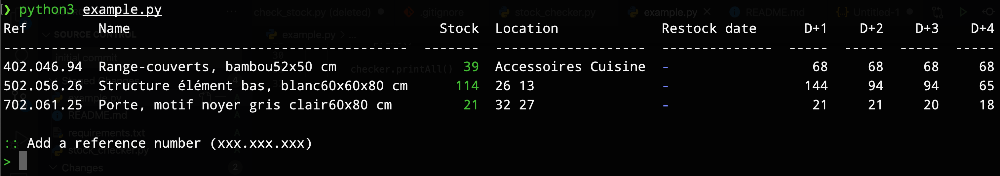

# Ikea Stock Checker

Get the remaining stock and location of ikea products.

> Note: This script uses a reverse engineered api. It could change or be deleted at any time.

## Usage

First you need the api url of your local store :

1. Go to Ikea website
2. Select your local store
3. Open the inspector of your browser
4. Select a product 
5. Search the api url from the XHR requests in the inspector

**Example**
```python
from stock_checker import StockChecker
# 562 => French store : Grand Parilly
checker = StockChecker('https://iows.ikea.com/retail/iows/fr/fr/stores/562/availability/ART')
checker.add_ref('402.046.94', 'Range-couverts, bambou52x50 cm')
checker.add_ref('502.056.26', 'Structure élément bas, blanc60x60x80 cm')
checker.add_ref('702.061.25', 'Porte, motif noyer gris clair60x80 cm')
checker.printAll()
```


## Screenshot

